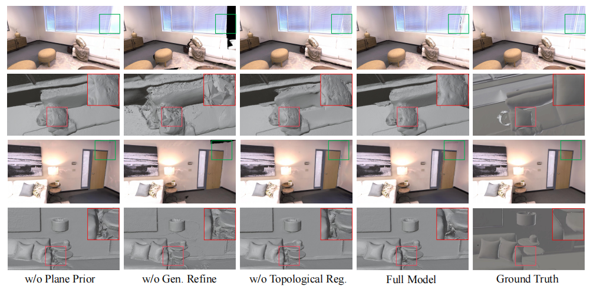

<h2 align="center" style="font-size:24px;">
  <b>High-Fidelity Indoor Surface Reconstruction with Gaussian Splatting via Curriculum Learning and Topology-Aware Regularization</b>
</h2>

<p align="center">
    <a href="">Haihong Xiao </a>,
    <a href="">Jiaqing Li </a>,
    <a href="">Jianan Zou </a>
</p>

## Abstract
Reconstructing high-fidelity 3D scenes from images using 3D Gaussian Splatting (3DGS) remains a challenging task due to the discrete nature of Gaussian positions. This challenge is further amplified under sparse-view settings, where limited observations often lead to geometric ambiguities—such as floaters and texture blurring—and, more critically, topological inconsistencies that hinder the extraction of watertight meshes. To address these limitations, we propose a novel framework for high-fidelity indoor surface reconstruction with gaussian splatting via curriculum learning and topology-aware regularization. Our approach is built upon the following two core innovations. First, we introduce a \textbf{Curriculum-based Generative Refinement (CGR)} strategy that leverages a generative diffusion model to hallucinate missing regions while preserving multi-view consistency, progressively expanding the training views from observed to unobserved regions for robust geometry completion. Second, we propose a novel \textbf{Topology-aware Regularization (TR)} module that constructs an anisotropic graph of Gaussians and employs spectral analysis to detect structural disconnections, actively repairing them via geometry-aware bridging and densification. Extensive qualitative and quantitative experiments on the Replica and ScanNet++ datasets demonstrate that our method consistently outperforms state-of-the-art approaches in terms of geometric accuracy (Chamfer Distance, F-Score and Normal Consistency), yielding high-fidelity 3D mesh reconstructions.

## ⚙️ Environment Setup

We recommend using Anaconda to manage your environment. Follow the steps below to prepare your workspace:

### 1. Base Environment
Clone the repository recursively to ensure all submodules are pulled:
```bash
git clone https://github.com/kinoko007/CLTR-GS.git --recursive
cd CLTR-GS

# Initialize conda environment
conda create -n cltr-gs python=3.9 -y
conda activate cltr-gs

# Install required system packages
conda install -c conda-forge cmake gmp cgal -y
```

### 2. Python Dependencies
Install PyTorch (CUDA 11.8 recommended) and other essential packages:
```bash
pip install torch==2.0.1 torchvision==0.15.2 torchaudio==2.0.2 --index-url https://download.pytorch.org/whl/cu118
pip install -r requirements.txt

# Install specific repositories from GitHub
pip install 'git+https://github.com/facebookresearch/pytorch3d.git@stable'
pip install 'git+https://github.com/facebookresearch/segment-anything.git'
pip install 'git+https://github.com/facebookresearch/detectron2.git' # Required for visualization
```

### 3. Compile Custom Modules
Compile the custom CUDA kernels and C++ extensions required for rasterization, meshing, and SfM features:

**Gaussian Splatting & Tetrahedralization:**
```bash
# Compile rasterizer and KNN
cd 2d-gaussian-splatting/submodules/diff-surfel-rasterization
pip install -e .
cd ../simple-knn
pip install -e .
cd ../tetra-triangulation

# Build tetra-triangulation
export CPATH=/usr/local/cuda-11.8/targets/x86_64-linux/include:$CPATH
export LD_LIBRARY_PATH=/usr/local/cuda-11.8/targets/x86_64-linux/lib:$LD_LIBRARY_PATH
export PATH=/usr/local/cuda-11.8/bin:$PATH
cmake . && make 
pip install -e .
cd ../../../
```

**MASt3R-SfM Components:**
```bash
# Build ASMK and CroCo models
cd mast3r/asmk/cython && cythonize *.pyx && cd ..
pip install .
cd ../dust3r/croco/models/curope/
python setup.py build_ext --inplace
cd ../../../../../
```

---

## 📥 Pretrained Weights

Fetch the necessary pretrained models (DepthAnythingV2, MASt3R, SAM, and See3D). We have bundled the download commands together for convenience:

```bash
# 1. Depth-Anything-V2 (Large)
mkdir -p ./Depth-Anything-V2/checkpoints/
wget https://huggingface.co/depth-anything/Depth-Anything-V2-Large/resolve/main/depth_anything_v2_vitl.pth -P ./Depth-Anything-V2/checkpoints/

# 2. MASt3R-SfM Checkpoints
mkdir -p ./mast3r/checkpoints/
wget https://download.europe.naverlabs.com/ComputerVision/MASt3R/MASt3R_ViTLarge_BaseDecoder_512_catmlpdpt_metric.pth -P ./mast3r/checkpoints/
wget https://download.europe.naverlabs.com/ComputerVision/MASt3R/MASt3R_ViTLarge_BaseDecoder_512_catmlpdpt_metric_retrieval_trainingfree.pth -P ./mast3r/checkpoints/
wget https://download.europe.naverlabs.com/ComputerVision/MASt3R/MASt3R_ViTLarge_BaseDecoder_512_catmlpdpt_metric_retrieval_codebook.pkl -P ./mast3r/checkpoints/

# 3. Segment Anything (SAM)
mkdir -p ./checkpoint/segment-anything/
wget https://dl.fbaipublicfiles.com/segment_anything/sam_vit_h_4b8939.pth -P ./checkpoint/segment-anything/
```

*Note for See3D:* Please download the See3D checkpoint directly from HuggingFace and place it in the following directory:
```bash
mv YOUR_LOCAL_PATH/MVD_weights ./checkpoint/MVD_weights
```

---

## 📁 Dataset Preparation

The processed datasets are hosted on HuggingFace. 
- Download the data from [here](https://huggingface.co/datasets/JunfengNi/G4Splat).
- Extract the contents directly into the `data` folder at the root of this project.

---

## 🚀 Training and Evaluation

The evaluation code is integrated into `train.py`, so evaluation will run automatically after training.

Run the basic pipeline using the following command:

```bash
# Tested on H800 100GB GPU.
python train.py \
    -s data/DATASET_NAME/SCAN_ID \
    -o output/DATASET_NAME/SCAN_ID \
    --sfm_config posed \
    --use_view_config \
    --config_view_num 5 \
    --select_inpaint_num 10 \
    --tetra_downsample_ratio 0.25
```

> **Hardware Tip:** If you are running into Out-Of-Memory (OOM) issues on hardware with less VRAM (like an RTX 4090 24GB or 60GB equivalents), simply append the `--use_downsample_gaussians` flag to your command.

---

## 🖼️ Results

Visual comparisons on Replica dataset:


Visual comparisons on Scannet++ dataset:


Visual comparison of ablation study on Replica:



---

## 🙏 Acknowledgements

Some codes are borrowed from [G4Splat](https://github.com/DaLi-Jack/G4Splat), [MAtCha](https://github.com/Anttwo/MAtCha), [See3D](https://github.com/baaivision/See3D), [MASt3R-SfM](https://github.com/naver/mast3r), [DepthAnythingV2](https://github.com/DepthAnything/Depth-Anything-V2), and [2DGS](https://github.com/hbb1/2d-gaussian-splatting). We thank all the authors for their great work.
