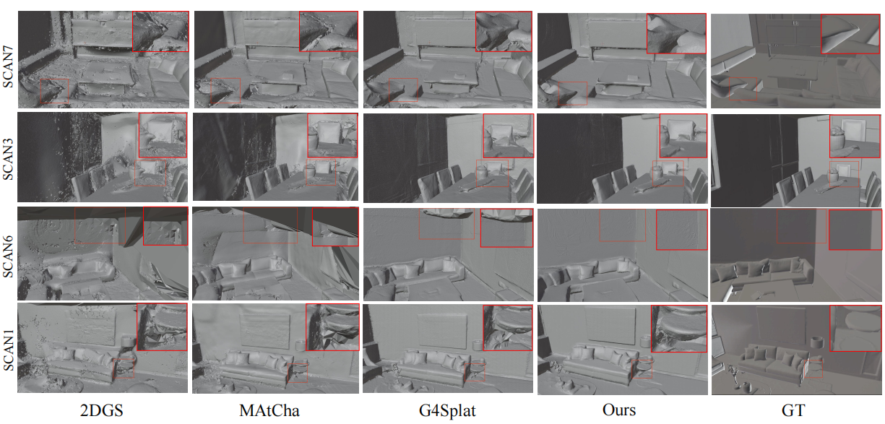
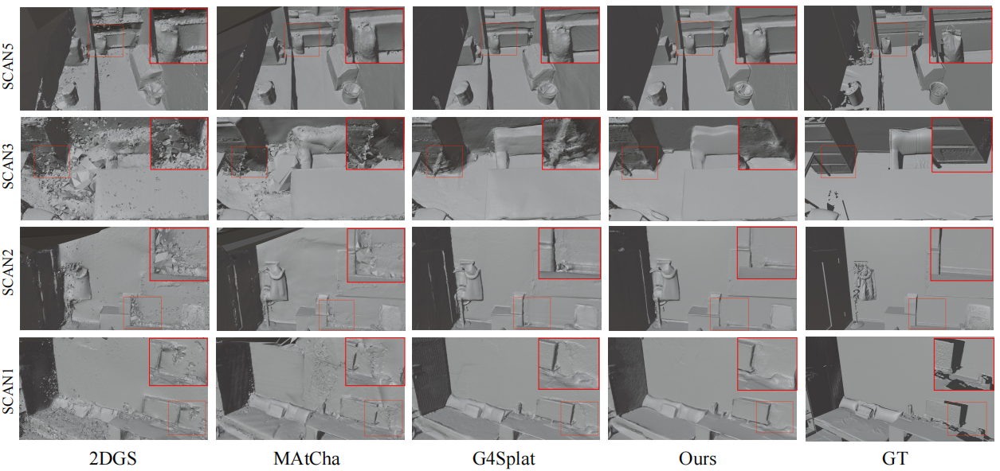

<h2 align="center" style="font-size:24px;">
  <b>High-Fidelity Indoor Surface Reconstruction with Gaussian Splatting via Curriculum Learning and Topology-Aware Regularization</b>
</h2>

<p align="center">
    <a href="">Haihong Xiao </a>,
    <a href="">Jiaqing Li </a>,
    <a href="">Jianan Zou </a>
</p>

## Abstract
Reconstructing high-fidelity 3D scenes from images using 3D Gaussian Splatting (3DGS) remains a challenging task due to the discrete nature of Gaussian positions. This challenge is further amplified under sparse-view settings, where limited observations often lead to geometric ambiguities—such as floaters and texture blurring—and, more critically, topological inconsistencies that hinder the extraction of watertight meshes. To address these limitations, we propose a novel framework for high-fidelity indoor surface reconstruction with gaussian splatting via curriculum learning and topology-aware regularization. Our approach is built upon the following two core innovations. First, we introduce a \textbf{Curriculum-based Generative Refinement (CGR)} strategy that leverages a generative diffusion model to hallucinate missing regions while preserving multi-view consistency, progressively expanding the training views from observed to unobserved regions for robust geometry completion. Second, we propose a novel \textbf{Topology-aware Regularization (TR)} module that constructs an anisotropic graph of Gaussians and employs spectral analysis to detect structural disconnections, actively repairing them via geometry-aware bridging and densification. Extensive qualitative and quantitative experiments on the Replica and ScanNet++ datasets demonstrate that our method consistently outperforms state-of-the-art approaches in terms of geometric accuracy (Chamfer Distance, F-Score and Normal Consistency), yielding high-fidelity 3D mesh reconstructions. We will make our code publicly available upon publication.

## 1. Installation


### 1.1. Install dependencies

Please follow the instructions below to install the dependencies:

```shell
git clone https://github.com/kinoko007/CLTR-GS.git --recursive

# Create and activate conda environment
conda create --name cltr-gs -y python=3.9
conda activate cltr-gs

# Install system dependencies via conda (required for compilation)
conda install cmake gmp cgal -c conda-forge

# Install PyTorch with CUDA support (adjust CUDA version as needed)
pip install torch==2.0.1 torchvision==0.15.2 torchaudio==2.0.2 --index-url https://download.pytorch.org/whl/cu118
pip install -r requirements.txt

pip install 'git+https://github.com/facebookresearch/pytorch3d.git@stable'
pip install 'git+https://github.com/facebookresearch/segment-anything.git'
# Detectron2 (used only for visualization)
pip install 'git+https://github.com/facebookresearch/detectron2.git'
```

Then, install the 2D Gaussian splatting and adaptive tetrahedralization dependencies:

```shell
cd 2d-gaussian-splatting/submodules/diff-surfel-rasterization
pip install -e .
cd ../simple-knn
pip install -e .
cd ../tetra-triangulation
cmake .
# you can specify your own cuda path
export CPATH=/usr/local/cuda-11.8/targets/x86_64-linux/include:$CPATH
export LD_LIBRARY_PATH=/usr/local/cuda-11.8/targets/x86_64-linux/lib:$LD_LIBRARY_PATH
export PATH=/usr/local/cuda-11.8/bin:$PATH
make 
pip install -e .
cd ../../../
```

Finally, install the MASt3R-SfM dependencies:

```shell
cd mast3r/asmk/cython
cythonize *.pyx
cd ..
pip install .
cd ../dust3r/croco/models/curope/
python setup.py build_ext --inplace
cd ../../../../../
```


### 1.2. Download pretrained models

First, download the pretrained checkpoint for DepthAnythingV2. Several encoder sizes are available; We recommend using the `large` encoder:

```shell
mkdir -p ./Depth-Anything-V2/checkpoints/
wget https://huggingface.co/depth-anything/Depth-Anything-V2-Large/resolve/main/depth_anything_v2_vitl.pth -P ./Depth-Anything-V2/checkpoints/
```

Then, download the MASt3R-SfM checkpoint:

```shell
mkdir -p ./mast3r/checkpoints/
wget https://download.europe.naverlabs.com/ComputerVision/MASt3R/MASt3R_ViTLarge_BaseDecoder_512_catmlpdpt_metric.pth -P ./mast3r/checkpoints/
```

Then, download the MASt3R-SfM retrieval checkpoint:

```shell
wget https://download.europe.naverlabs.com/ComputerVision/MASt3R/MASt3R_ViTLarge_BaseDecoder_512_catmlpdpt_metric_retrieval_trainingfree.pth -P ./mast3r/checkpoints/
wget https://download.europe.naverlabs.com/ComputerVision/MASt3R/MASt3R_ViTLarge_BaseDecoder_512_catmlpdpt_metric_retrieval_codebook.pkl -P ./mast3r/checkpoints/
```

Then, download the SAM checkpoint:
```shell
mkdir -p ./checkpoint/
mkdir -p ./checkpoint/segment-anything/
wget https://dl.fbaipublicfiles.com/segment_anything/sam_vit_h_4b8939.pth -P ./checkpoint/segment-anything/
```

Finally, download the See3D checkpoint:
```shell
# Download the See3D checkpoint from HuggingFace first, then move it to the desired path
mv YOUR_LOCAL_PATH/MVD_weights ./checkpoint/MVD_weights
```


## 2.data
Please download the preprocessed [data](https://huggingface.co/datasets/JunfengNi/G4Splat) from HuggingFace and unzip in the `data` folder.


## 3.Training and Evaluation
The evaluation code is integrated into `train.py`, so evaluation will run automatically after training.
```bash
# Tested on H800 100GB GPU. You can add "--use_downsample_gaussians" to run on a 4090 60GB GPU.
python train.py -s data/DATASET_NAME/SCAN_ID -o output/DATASET_NAME/SCAN_ID --sfm_config posed --use_view_config --config_view_num 5 --select_inpaint_num 10  --tetra_downsample_ratio 0.25
```

## Results
Visual comparisons on Replica dataset:

<p align="center">

</p>

Visual comparisons on Scannet++ dataset:

<p align="center">

</p>

Visual comparison of ablation study on Replica:

<p align="center">

</p>

## Acknowledgements
Some codes are borrowed from [G4splat](https://github.com/DaLi-Jack/G4Splat), [MAtCha](https://github.com/Anttwo/MAtCha), [See3D](https://github.com/baaivision/See3D), [MASt3R-SfM](https://github.com/naver/mast3r), [DepthAnythingV2](https://github.com/DepthAnything/Depth-Anything-V2), [2DGS](https://github.com/hbb1/2d-gaussian-splatting). We thank all the authors for their great work. 

